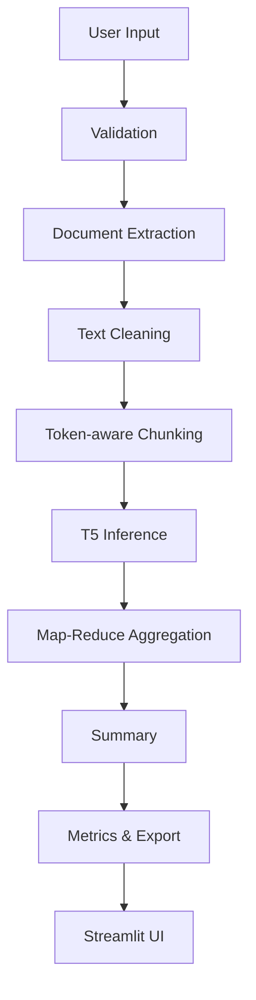

# T5 Summarizer

A modular AI-powered document summarization application built around Google's T5 model, with GPU acceleration, token-aware long-document processing, OCR, multi-format document extraction, and Streamlit UI.

---

## 🚀 Feature Highlights

* **Local T5 Inference**: High-quality offline summarization using Hugging Face T5 models.
* **CPU + CUDA Acceleration**: Automatic hardware detection to utilize CUDA GPUs or fallback to CPU execution.
* **PDF / DOCX / TXT / Markdown**: Direct, robust text parsing across multiple formats.
* **OCR with Tesseract**: Optical Character Recognition to extract and summarize text from uploaded images.
* **Audio Transcription**: Speech-to-text pipeline using SpeechRecognition and pydub.
* **Token-aware Map-Reduce Summarization**: Token-bound document partitioning to process long files without truncation.
* **Runtime Analytics**: Profiling dashboard showing execution speed, compression ratios, and hardware metrics.
* **Secure API-key Handling**: Optional Gemini configurations handled safely via env variables (no hardcoded keys).
* **Automated Tests**: Comprehensive 26-test suite verifying services, chunking boundaries, and parsing routers.

---

## 📊 Example Local Benchmark

The following results were measured during local runtime verification:
- **CPU T5 inference**: 1.9433 seconds
- **CUDA T5 inference**: 2.4178 seconds
- **Long-document test**: 861 words
- **Chunks processed**: 4

*Note: These benchmarks reflect typical offline execution times for the `t5-small` model on representative inputs.*

---

## 🧩 Feature Status

| Feature                     | Status                |
| --------------------------- | --------------------- |
| T5 CPU                      | ✅ Verified            |
| T5 CUDA                     | ✅ Verified            |
| Long-document summarization | ✅ Verified            |
| PDF                         | ✅ Verified            |
| DOCX                        | ✅ Verified            |
| OCR                         | ✅ Verified            |
| Audio                       | ✅ Verified            |
| Gemini                      | ⚠️ API key required   |

---

## 📐 Architecture Diagram

The application parses multi-format files, handles translations, chunks long texts to respect token boundaries, runs model inference, and aggregates outputs.



---

## 📁 Project Structure

```text
app/
├── core/
│   ├── config.py           # Configuration management (Pydantic Settings)
│   ├── logging_config.py   # Centralized application logging
│   └── exceptions.py       # Custom exceptions
├── models/
│   ├── t5_model.py         # Local T5 wrapper (Inference Mode & Caching)
│   └── gemini_model.py     # Gemini wrapper (Legacy SDK)
├── services/
│   ├── summarization.py    # Summarization service & Map-Reduce orchestrator
│   ├── text_processing.py  # Cleaning, word & token-aware chunking
│   ├── document_processor.py# Text extraction from PDF, DOCX, TXT, MD, Images, Audio
│   └── translation.py      # Language detection & translation pipeline
├── utils/
│   ├── validators.py       # Input parameters & upload validation
│   ├── helpers.py          # Timing metrics & ReportLab PDF exporter
│   └── metrics.py          # Word counters & compression ratio
├── ui/
│   ├── components.py       # Sidebar control hub & metrics panel
│   └── styles.py           # Custom CSS stylesheets inject
└── main.py                 # Application entrypoint & programmatic runner

tests/
├── test_summarization.py   # Tests direct and Map-Reduce summaries
├── test_text_processing.py # Tests clean text and chunks boundaries
├── test_document_processing.py # Tests mocked document parsers
└── test_utils.py           # Tests metrics and validators
```

---

## ⚙️ Installation & Running

### Prerequisites
To use OCR and Audio parsing, make sure you install the system packages:
- **macOS**: `brew install tesseract ffmpeg`
- **Linux (Debian/Ubuntu)**: `sudo apt-get install tesseract-ocr ffmpeg`
- **Windows**: Install Tesseract and FFmpeg via scoop, winget, or by downloading the official binary installers and adding them to your system PATH.

### Local Installation
1. Clone the repository and navigate into it:
   ```bash
   git clone https://github.com/charanjalluri/Text-Summarization-using-T5-model.git
   cd Text-Summarization-using-T5-model
   ```

2. Initialize and activate a virtual environment:
   ```bash
   python -m venv .venv
   
   # Windows PowerShell
   .venv\Scripts\Activate.ps1
   
   # Linux / macOS
   source .venv/bin/activate
   ```

3. Install requirements:
   ```bash
   pip install -r requirements.txt
   ```

4. Run the Streamlit application:
   ```bash
   streamlit run app/main.py
   ```
   Or launch directly via Python:
   ```bash
   python app/main.py
   ```
   Open your browser at `http://localhost:8501`.

---

## 🌐 Environment Variables

Optionally create a `.env` file from the provided template:
```bash
cp .env.example .env
```
- `GEMINI_API_KEY`: API key for Google Gemini.
- **Note**: Gemini is optional. The local T5 summarizer operates fully offline and does not require a Gemini API key.

---

## 🛡️ Security Measures

- **Environment-based Secrets**: No hardcoded API keys. Stored in configuration models or password-masked Streamlit inputs.
- **Transcriber Resource Cleanup**: Audio parsing unlinks temporary WAV audio files inside `finally` blocks to prevent disk space leakage.
- **Upload Validation**: File upload sizes are strictly capped at 10MB and file extensions are matched against a whitelist to prevent path traversals or memory attacks.
- **No Credentials Committed**: `.gitignore` prevents tracking `.env` configurations.

---

## 🧪 Testing & Code Quality

Verify that all unit tests, styling checks, and compilation tests pass cleanly.

### Run pytest suite
Runs 26 unit tests (including mock evaluations of model downloads and external calls):
```bash
python -m pytest -v
```

### Run Ruff static checks
Verifies style, naming conventions, and syntax format:
```bash
python -m ruff check .
```

### Verification compiler
Verify there are no syntax errors:
```bash
python -m compileall app tests
```

---

## ⚠️ Known Limitations

- **Gemini**: Requires a configured Google Gemini API key to work.
- **Audio**: Speech-to-text transcription routes requests to Google's Web Speech API and requires active internet access.
- **OCR**: OCR requires the `tesseract` system binary to be installed on the host.

---

## 🖼️ Demo

Screenshots coming soon.

---

## 📄 License

Licensed under the MIT License. See [LICENSE](file:///d:/Text-Summarization-using-T5-model/LICENSE) for details.
